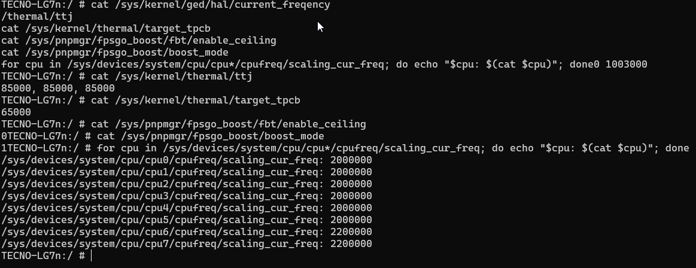

# Performance Unlock for LG7n
**by DGameXO**

---

## Ini file apa?

Magisk module yang unlock performa CPU untuk **TECNO Pova 4 (LG7n)**.

Secara default, HiOS menggunakan governor `sugov_ext` yang memprioritaskan efisiensi baterai — akibatnya CPU di-cap secara artifisial bahkan saat load tinggi seperti gaming. Module ini melepas cap tersebut biar CPU bisa boost ke clock maksimal saat dibutuhkan.

---

## Masalah yang diselesaikan

TECNO Pova 4 LG7n menggunakan FPSGO (Frame Per Second Governor) dari MediaTek dengan `enable_ceiling = 1` secara default. Ceiling ini membatasi clock CPU meski GPU dan CPU sedang dibutuhkan penuh, menyebabkan:

- FPS tidak stabil saat gaming berat
- CPU big core (CPU6/CPU7) stuck di 900MHz padahal max 2200MHz
- Performa tidak konsisten meski suhu masih aman

---

## Apa yang dilakukan module ini?

Setiap boot, module jalankan:

- `enable_ceiling = 0` — lepas cap clock CPU dari FPSGO
- `boost_mode = 1` — aktifkan FPSGO performance boost mode
- `boost_enable = 1` — pastikan boost aktif

CPU tetap efisien saat idle — governor `sugov_ext` yang ngatur clock naik/turun sesuai load. 2200MHz hanya muncul saat CPU beneran dibutuhkan.

---

## Hasil

| Kondisi | Sebelum | Sesudah |
|---------|---------|---------|
| CPU6/CPU7 idle | 900MHz | 500-900MHz (normal) |
| CPU6/CPU7 gaming | 900-1300MHz | **2200MHz** |
| Janky frames | 18.60% | 9.76% |

---

## Requirements

- TECNO Pova 4 **(LG7n only)**
- Magisk v20.4+
- Root access

> ⚠️ Disarankan dipakai bersamaan dengan **Thermal Rebalance for LG7n** biar suhu tetap terkontrol.

---

## Instalasi

1. Download `lg7n-perf-unlock-DGameXO-v1.zip`
2. Buka Magisk → Modules → Install from storage
3. Pilih file zip
4. Reboot

---

## Uninstall

Magisk → Modules → Remove → Reboot.

---

*Tested on TECNO Pova 4 LG7n — Android 12, HiOS 12, Kernel Mahiru v26*
